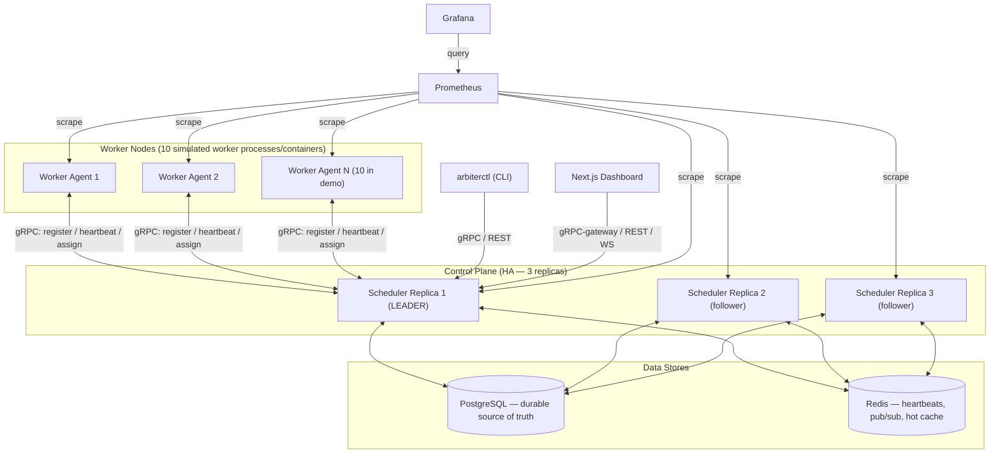
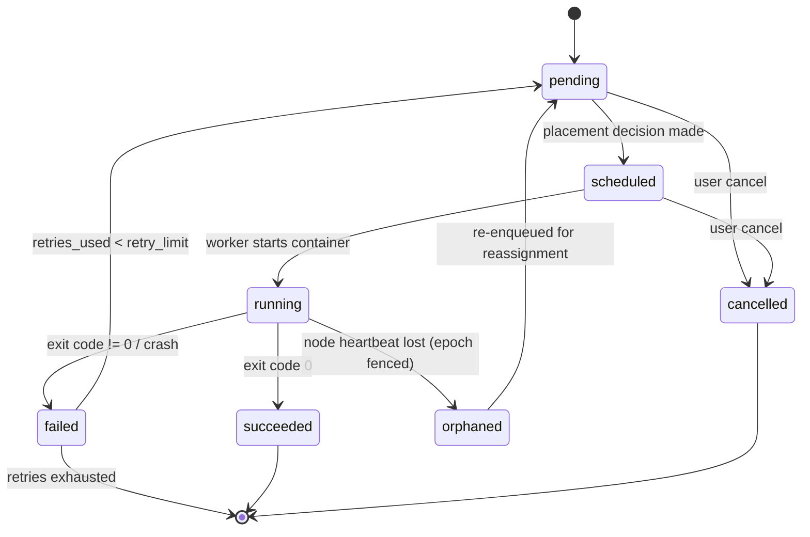
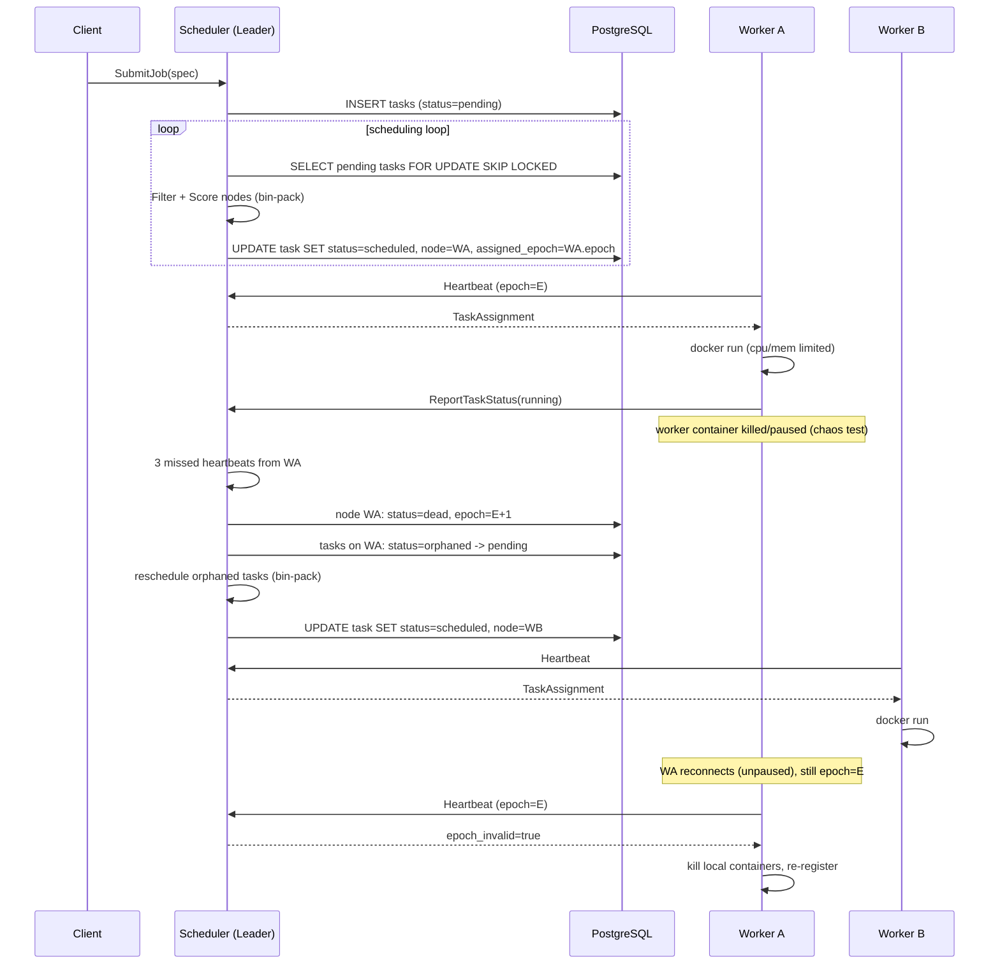
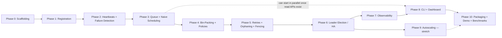

# Arbiter — Distributed Scheduler & Compute Orchestration

**Implementation Plan v2** (updated with locked-in scope decisions)

This document is the master implementation plan for **Arbiter**, a from-scratch distributed
scheduler / compute orchestrator (a small, student-scoped cousin of Kubernetes/Borg/Nomad/Mesos).
It is written to be built incrementally, phase by phase, with something runnable and demoable at
the end of every phase.

> **v2 changelog:** all scope questions from v1 are now decided (see Section 12, "Decisions Log").
> This version also adds Section 4, **Development Environment & Cross-Platform Compatibility**,
> since primary development happens on Windows.

> **How to use this doc:** Work top to bottom. Each phase has a goal, concrete tasks, and a
> "Definition of Done" you can literally check off.

---

## 1. Goals & Non-Goals

**Goal:** Build a system where you submit units of work ("tasks"), and a cluster of worker nodes
executes them, while the control plane:

- Tracks cluster capacity and utilization (CPU + memory).
- Places tasks onto nodes using a bin-packing scheduling algorithm.
- Detects node/network failures via heartbeats.
- Automatically reassigns work from dead nodes onto healthy ones.
- Tolerates the failure of the scheduler itself via leader election among replicas.
- Exposes metrics (Prometheus/Grafana), a CLI, and a web dashboard.

**Non-goals (explicitly out of scope, to keep this undergrad-scoped):**

- Not a general-purpose container runtime (we use Docker as a building block, we don't build one).
- Not multi-tenant / multi-namespace — single global cluster, no namespaces, no auth.
- Not moving/streaming data between nodes (that's a different project — this project schedules
  *computation*, not data pipelines).
- Not GPU-aware or heterogeneous-resource scheduling — CPU + memory only.
- Not a production-grade, internet-facing system. No TLS, no rate limiting, no auth.
- Not deployed onto a real Kubernetes cluster — Docker Compose is the only deployment target.
  Effort saved here is spent on distributed-systems depth instead (see Section 11).
- Not a real multi-machine cluster — the "10 nodes" are 10 simulated worker processes/containers on
  a single development machine, not separate physical hardware (see Section 12, Q3).

**Resume line this project is built to support:**

> Built a cluster scheduler sustaining 500+ concurrent tasks across 10 nodes via leader-elected
> coordination, heartbeat-based failure detection with sub-3s failover, bin-packing allocation, and
> automatic task reassignment

Every clause in that sentence maps to a specific phase and a specific measurable test in this plan
(see Section 10). Don't put a number on your resume that you haven't actually measured — Section 10
gives you the exact script to produce real, reproducible numbers. "10 nodes" and "500+ concurrent
tasks" are honest as a *simulated* cluster (10 worker processes/containers) — this is completely
normal and expected for a project like this; see Section 12, Q3 for the reasoning.

---

## 2. High-Level Architecture



**Key idea:** only the elected *leader* scheduler replica makes placement decisions and talks to
workers. Followers stay hot (connected to Postgres/Redis, ready to take over) but reject scheduling
actions and redirect clients to the current leader. If the leader dies, a follower acquires the
lease and takes over — that's your "leader-elected coordination" and HA story.

---

## 3. Tech Stack — Role of Each Piece

| Tech | Role in Arbiter |
|---|---|
| **Go** | All control-plane and worker-agent services (scheduler, worker agent, CLI). Chosen because it's the language of the systems it mimics (Kubernetes, Nomad, etcd) and has first-class gRPC + concurrency support. Also chosen because Go cross-compiles cleanly to Windows/macOS/Linux with zero native-dependency headaches — important given local development happens on Windows (Section 4). |
| **gRPC + Protobuf** | The cluster-internal protocol: worker↔scheduler registration, heartbeats, task assignment, status reporting. Also the client-facing API for job submission (via gRPC directly and/or grpc-gateway for REST/JSON). |
| **PostgreSQL** | Durable source of truth: nodes, jobs, tasks, task history, leader lease, audit/event log. Task queue implemented via `SELECT ... FOR UPDATE SKIP LOCKED` — no second queue system to keep consistent. Also the chosen leader-election backend (Section 6.6, decided). |
| **Redis** | Fast/ephemeral state only: last-heartbeat timestamps (failure detector reads this hot path frequently), pub/sub for live cluster events (feeds the dashboard), optional cached cluster-state snapshot for cheap dashboard reads. **Never** the source of truth for task state — avoids dual-write inconsistency bugs. |
| **Docker** | Task execution sandbox (decided — Section 12, Q2). Each task runs as a Docker container on its assigned worker, giving real CPU/memory limits (`--cpus`, `--memory`) and isolation, mirroring how real orchestrators run workloads. Also used to simulate the 10 worker "nodes" themselves as 10 containers on one host (Section 12, Q3). |
| **Prometheus** | Metrics scraped from every scheduler replica and every worker agent: scheduling latency, queue depth, node counts by status, heartbeat misses, election counts, task throughput. |
| **Grafana** | Dashboards on top of Prometheus: cluster utilization, task throughput, failover events. |
| **Next.js + TypeScript** | Web dashboard: cluster/node grid, job/task tables, submit-job form, live event feed. |
| **Python** | Tooling only, not a core service: (1) load-test/benchmark harness that submits bursts of tasks and records throughput/latency, (2) chaos-injection script that kills/pauses worker containers via the Docker API (deliberately *not* raw OS signals — see Section 4 for why), (3) trivial example "workloads" (the actual program each task container runs, e.g. a sleep/CPU-burn script) so tasks have something realistic-but-simple to execute. |

> **Note on Kubernetes:** the original project brief lists Kubernetes as part of the tech stack, but
> per Section 12 (Q5) we're explicitly **not** deploying Arbiter onto a real Kubernetes cluster for
> this project, in order to spend that time on distributed-systems depth instead (Raft as a stretch
> goal, more thorough chaos testing, etc.). If you still want "Kubernetes" as a resume keyword for
> this project, treat it as a candidate to cut from the tech-stack list unless you circle back to
> the (now removed) meta-deployment stretch goal later.

---

## 4. Development Environment & Cross-Platform Compatibility (Windows)

Primary development happens on **Windows**. The system is designed so that, in practice, ~95% of it
already runs identically regardless of host OS, because almost everything actually executes *inside
Linux containers* via Docker Compose. The few remaining Windows-specific traps are called out below
so you don't lose time to them mid-project.

### 4.1 Recommended setup: Docker Desktop + WSL2

- Install **Docker Desktop for Windows** with the **WSL2 backend** enabled (this is the default and
  recommended mode for Docker Desktop today).
- Do your day-to-day development from inside a **WSL2 distro** (e.g. Ubuntu, via `wsl --install`),
  not from native `cmd.exe`/PowerShell. This gives you:
  - A real `bash`, so every script in `scripts/` and every `Makefile` target works unmodified.
  - Native `make`, `git`, and standard Unix tooling with no extra installs.
  - Best Docker bind-mount and file-watch performance when your repo lives on the WSL2 filesystem
    (e.g. `~/dev/arbiter-distributed-scheduler`) rather than under `/mnt/c/...`.
  - `docker`/`docker compose` CLI commands run from inside WSL2 transparently talk to the same
    Docker Desktop engine — no extra configuration needed beyond enabling WSL2 integration for your
    distro in Docker Desktop's settings.
- VS Code's "Remote - WSL" extension (or Cursor's WSL support) lets you edit the WSL2-hosted repo
  seamlessly from a normal-feeling Windows editor window.

This is the only setup this plan assumes going forward. It is **not** a workaround — it's the
standard, officially-recommended way to do Linux-container-based development on Windows, and it's
what most real backend/infra engineers on Windows actually use day to day.

### 4.2 Things that would break on native Windows (and how we avoid them)

| Risk | Why it breaks on native Windows | How Arbiter avoids it |
|---|---|---|
| Bash scripts (`Makefile`, `scripts/*.sh` if any) | No native bash/make in `cmd.exe`/PowerShell | Developed and run from WSL2 (Section 4.1); nothing in the plan requires native Windows shells. |
| CRLF line endings on scripts baked into Linux containers | A `.sh`/entrypoint script saved with CRLF line endings fails inside a Linux container with a cryptic `bad interpreter: No such file or directory` error | Commit a `.gitattributes` (Phase 0) forcing LF for `*.sh`, `*.go`, `*.proto`, `Makefile`, and `Dockerfile*`, regardless of the OS/editor that touched them. |
| Simulating a "paused" node via raw POSIX signals (`SIGSTOP`) | `SIGSTOP` doesn't exist on Windows; a chaos script using `os.kill(pid, signal.SIGSTOP)` would only work on Linux/macOS hosts | `chaos_monkey.py` never signals processes directly — it always acts on **containers** via the Docker Engine API (`docker pause` / `docker unpause` / `docker kill`, or the `docker-py` SDK equivalents). This is not just a Windows workaround, it's also the *more correct* design: workers already run as Docker containers, so pausing at the container/cgroup level is the realistic failure mode to simulate anyway. |
| Hardcoded Unix paths in Go code (e.g. `/tmp/...`) | Would fail if you ever run a Go binary natively on Windows (e.g. for quick local debugging outside Docker) | Coding guideline: always use `os.TempDir()` / `filepath.Join` in Go code, never hardcoded Unix paths. |
| Installing Postgres/Redis natively on Windows | Native Windows installs of Postgres/Redis are possible but fiddly and unnecessary | Never install them natively — always use the Dockerized versions from `docker-compose.yml`/`docker-compose.demo.yml`. |
| Docker socket mount for worker→Docker-daemon access | Path syntax difference between Windows and Linux for `/var/run/docker.sock` | With Docker Desktop + WSL2, `docker-compose.yml`'s standard `- /var/run/docker.sock:/var/run/docker.sock` bind mount works unmodified because Compose is interpreted inside the Linux VM Docker Desktop manages — no path translation needed on your part. |

### 4.3 If you ever want a native Windows binary

Go binaries (scheduler, worker, `arbiterctl`) are trivially cross-compilable
(`GOOS=windows GOARCH=amd64 go build ...`) if you ever want a native `arbiterctl.exe` outside WSL2
for convenience. This is optional — the CLI works fine invoked from inside WSL2 like everything
else — but it's a nice side benefit of choosing Go (Section 12, Q9) worth knowing about.

---

## 5. Repository Layout

```
arbiter-distributed-scheduler/
├── .gitattributes           # forces LF for scripts/Go/proto/Dockerfiles (Section 4.2)
├── cmd/
│   ├── scheduler/          # main.go for the scheduler binary
│   ├── worker/             # main.go for the worker-agent binary
│   └── arbiterctl/         # main.go for the CLI
├── internal/
│   ├── scheduler/          # placement engine: filter/score plugins, queue, retry, orchestration loop
│   ├── election/           # leader election (lease acquisition/renewal, fencing epochs)
│   ├── failuredetector/    # heartbeat timeout tracking, node status transitions
│   ├── store/              # Postgres repositories (nodes, jobs, tasks, leases, events)
│   ├── cache/              # Redis client wrappers (heartbeats, pub/sub)
│   ├── grpcapi/            # generated pb.go + handwritten server implementations
│   ├── executor/           # worker-side: Docker SDK wrapper, container lifecycle, resource limits
│   └── metrics/            # Prometheus collectors shared by scheduler + worker
├── proto/
│   └── arbiter/v1/*.proto
├── migrations/              # SQL migrations (golang-migrate or goose)
├── dashboard/               # Next.js + TypeScript app
├── scripts/                 # Python: load_test.py, chaos_monkey.py, example workloads
├── deploy/
│   ├── docker-compose.yml         # minimal dev stack (1 scheduler, 2 workers, pg, redis)
│   ├── docker-compose.demo.yml    # full demo (3 schedulers, 10 workers, pg, redis, prom, grafana, dashboard)
│   ├── prometheus/prometheus.yml
│   └── grafana/provisioning/
├── docs/
│   ├── architecture.md
│   ├── design-decisions.md
│   └── benchmarks/                # recorded output from Section 10 benchmark runs
├── Makefile
├── go.mod
└── README.md
```

---

## 6. Core Design Decisions

### 6.1 Data Model (PostgreSQL)

```sql
-- Cluster membership
CREATE TABLE nodes (
    id                 UUID PRIMARY KEY DEFAULT gen_random_uuid(),
    hostname           TEXT NOT NULL,
    address            TEXT NOT NULL,           -- host:port for gRPC callback if needed
    cpu_capacity_mc    BIGINT NOT NULL,          -- millicores, e.g. 2000 = 2 cores
    mem_capacity_mb    BIGINT NOT NULL,
    labels             JSONB NOT NULL DEFAULT '{}',
    status             TEXT NOT NULL DEFAULT 'unknown', -- unknown|ready|not_ready|dead|cordoned
    epoch              BIGINT NOT NULL DEFAULT 0,        -- fencing generation, incremented on re-registration
    last_heartbeat_at  TIMESTAMPTZ,
    created_at         TIMESTAMPTZ NOT NULL DEFAULT now()
);

-- Logical unit of submission (may expand into N tasks, e.g. "replicas: 5")
CREATE TABLE jobs (
    id                 UUID PRIMARY KEY DEFAULT gen_random_uuid(),
    name               TEXT NOT NULL,
    image              TEXT NOT NULL,
    command             TEXT[],
    cpu_request_mc     BIGINT NOT NULL,
    mem_request_mb     BIGINT NOT NULL,
    replicas           INT NOT NULL DEFAULT 1,
    retry_limit        INT NOT NULL DEFAULT 3,
    scheduling_policy  TEXT NOT NULL DEFAULT 'bin_pack', -- bin_pack|spread
    constraints        JSONB NOT NULL DEFAULT '{}',       -- label selectors, anti-affinity
    created_at         TIMESTAMPTZ NOT NULL DEFAULT now()
);

-- Individual schedulable unit of work
CREATE TABLE tasks (
    id                 UUID PRIMARY KEY DEFAULT gen_random_uuid(),
    job_id             UUID NOT NULL REFERENCES jobs(id),
    status             TEXT NOT NULL DEFAULT 'pending',
        -- pending|scheduled|running|succeeded|failed|orphaned|cancelled
    assigned_node_id   UUID REFERENCES nodes(id),
    assigned_epoch     BIGINT,                   -- node epoch at time of assignment (fencing check)
    retries_used       INT NOT NULL DEFAULT 0,
    exit_code          INT,
    last_error         TEXT,
    created_at         TIMESTAMPTZ NOT NULL DEFAULT now(),
    scheduled_at       TIMESTAMPTZ,
    started_at         TIMESTAMPTZ,
    finished_at        TIMESTAMPTZ
);
CREATE INDEX idx_tasks_status ON tasks(status);

-- Single-row-per-cluster leader lease with fencing token
CREATE TABLE leader_lease (
    id            INT PRIMARY KEY DEFAULT 1 CHECK (id = 1),
    leader_id     TEXT NOT NULL,
    epoch         BIGINT NOT NULL DEFAULT 0,
    acquired_at   TIMESTAMPTZ NOT NULL,
    expires_at    TIMESTAMPTZ NOT NULL
);

-- Audit trail for dashboard timeline / debugging
CREATE TABLE events (
    id           BIGSERIAL PRIMARY KEY,
    entity_type  TEXT NOT NULL,   -- node|task|job|leader
    entity_id    TEXT NOT NULL,
    event_type   TEXT NOT NULL,   -- registered|heartbeat_missed|dead|scheduled|reassigned|elected|...
    message      TEXT,
    created_at   TIMESTAMPTZ NOT NULL DEFAULT now()
);
```

**Redis keys (ephemeral only):**

- `hb:{node_id}` → last-seen unix-ms timestamp, `EXPIRE` set to a few heartbeat intervals.
- `pubsub:cluster-events` → channel the leader publishes to; the dashboard's WS/SSE gateway
  subscribes and fans out to browser clients.

### 6.2 Task Queue

Use Postgres directly — no separate queue system:

```sql
SELECT id FROM tasks
WHERE status = 'pending'
ORDER BY created_at
FOR UPDATE SKIP LOCKED
LIMIT 50;
```

This gives you safe concurrent pulls (important once you have 3 scheduler replicas, even though
only the leader should normally be pulling — `SKIP LOCKED` is still a good safety net) without
introducing a second system of record that could drift from Postgres.

### 6.3 Scheduling Algorithm (Filter → Score, à la Kubernetes)

**Filter phase** (hard constraints — a node is either eligible or not):
1. Node status is `ready` (not dead/cordoned/not_ready).
2. `free_cpu_mc >= task.cpu_request_mc` and `free_mem_mb >= task.mem_request_mb`.
3. Node labels satisfy the job's label selector / anti-affinity constraints.

**Score phase** (rank remaining eligible nodes):
- **Bin-pack scorer (default):** score = how "full" the node would become after placement — prefer
  the node that leaves the *least* leftover capacity. Consolidates load onto fewer nodes, which is
  literally what "bin-packing allocation" on your resume means, and also sets up the autoscaling
  stretch goal (idle nodes become fully empty and reclaimable).
- **Spread scorer (alternative, selectable per job):** score = inverse of current utilization —
  prefer the *least*-loaded node. Useful for HA-sensitive workloads; demonstrates that scheduling
  policy is pluggable, another real-world orchestrator concept.

Only CPU and memory are modeled as schedulable resources (decided — Section 12, Q10); no GPU/disk
dimensions.

Implement as a small internal interface so both scorers share the filter step:

```go
type Filter interface {
    Passes(node Node, task Task) bool
}
type Scorer interface {
    Score(node Node, task Task) float64 // higher = more preferred
}
```

### 6.4 Heartbeats & Failure Detection

- Worker → Scheduler heartbeat every `H` ms (default 500–1000ms), carrying current allocated
  resources and any task status changes since last heartbeat.
- Scheduler stores `last_seen` in Redis on every heartbeat (fast path) and periodically flushes to
  Postgres `nodes.last_heartbeat_at` (durability, not hot path).
- Background **failure detector** loop on the leader runs every `H/2` ms: any node whose last-seen
  exceeds `M` missed intervals (default `M=3`, so ~1.5–3s) is transitioned `ready → dead`.
- On transition to `dead`:
  1. Increment the node's `epoch` (fencing — see 6.5).
  2. Mark all tasks with `assigned_node_id = node.id AND status = 'running'` as `orphaned`.
  3. Re-enqueue orphaned tasks as `pending` so the scheduler loop picks them up for reassignment
     onto a healthy node.
  4. Emit an `events` row + Redis pub/sub message (dashboard shows this live).

### 6.5 Fencing — Preventing "Zombie" Task Execution

This is the trickiest, highest-learning-value part of the project: **a node that stops sending
heartbeats might not actually be dead** — it could be behind a network partition and still running
its container. If it reconnects after being marked dead and reassigned, you must not let it keep
reporting status for a task that's now running elsewhere (silent double-execution/data corruption
in a real system).

Mechanism:
- Each node has an `epoch` (generation number), incremented every time the scheduler decides the
  node is dead.
- Every task assignment sent to a worker includes the node's epoch at assignment time
  (`assigned_epoch`).
- Every heartbeat/status report from a worker includes the epoch it *believes* it's on.
- If the scheduler receives a report with an epoch older than the node's current epoch in Postgres,
  it responds with `epoch_invalid = true`. The worker must then kill all local containers and
  re-register from scratch before doing anything else.

This one mechanism is what separates "toy heartbeat checker" from an actually-correct fault-tolerant
system, and is very explicitly callable-out in an interview ("how do you prevent split-brain from
causing duplicate execution?").

### 6.6 Leader Election (Control-Plane HA) — Decided: Postgres Lease

**Decided approach (Section 12, Q1): Postgres lease with fencing token.** Rationale:
- No new infra dependency (Postgres already required).
- It's the same *pattern* real Kubernetes control planes use for leader election
  (`client-go`'s `leaderelection` package — a lease object with a holder identity and renew
  deadline), just backed by Postgres instead of etcd.

Algorithm (each scheduler replica runs this loop):
```
loop every renew_interval:
  BEGIN;
  SELECT * FROM leader_lease WHERE id = 1 FOR UPDATE;
  if lease.expires_at < now() OR lease.leader_id == self.id:
      new_epoch = lease.epoch + (lease.leader_id == self.id ? 0 : 1)
      UPDATE leader_lease
      SET leader_id = self.id, epoch = new_epoch,
          acquired_at = now(), expires_at = now() + lease_ttl
      WHERE id = 1;
      self.isLeader = true
      self.currentEpoch = new_epoch
  else:
      self.isLeader = false
  COMMIT;
```
- `lease_ttl` default 5s, `renew_interval` default 1–2s (renew well before expiry).
- Only the leader runs the scheduling loop and failure detector; followers run a lightweight loop
  that just tries to acquire the lease and otherwise stay idle/read-only.
- Followers redirect/proxy client-facing RPCs (`SubmitJob`, etc.) to the current leader's address
  (stored alongside the lease, or looked up from `leader_id`).
- Real Raft-based consensus (`hashicorp/raft`) remains available as a **stretch goal** if you want
  to go deeper on consensus after the core system works — see Section 11.

### 6.7 Task Execution on the Worker — Decided: Docker

- Worker agent uses the Docker Engine SDK for Go (`github.com/docker/docker/client`) to:
  - `ContainerCreate` with `Resources.NanoCPUs` / `Memory` set from the task's request (real
    enforcement, not just accounting).
  - `ContainerStart`, then watch for exit via `ContainerWait`.
  - On exit, report `{exit_code, status}` back to the scheduler on the next heartbeat (or
    immediately via a dedicated `ReportTaskStatus` RPC for lower latency).
  - On receiving a cancel/epoch-invalid instruction, `ContainerStop` + `ContainerRemove`.
- In Docker Compose, the worker container must mount the host Docker socket
  (`/var/run/docker.sock:/var/run/docker.sock`) so it can launch *sibling* containers on the host
  Docker daemon — this is the standard "Docker-out-of-Docker" pattern for exactly this kind of demo,
  and works unmodified under Docker Desktop + WSL2 (Section 4.2).

### 6.8 Task Lifecycle (State Machine)



### 6.9 End-to-End Sequence (Happy Path + Failover)



---

## 7. gRPC API Sketch (`proto/arbiter/v1/arbiter.proto`)

```protobuf
syntax = "proto3";
package arbiter.v1;

service ClusterControl {
  rpc RegisterNode(RegisterNodeRequest) returns (RegisterNodeResponse);
  rpc Heartbeat(stream HeartbeatRequest) returns (stream HeartbeatResponse);
  rpc ReportTaskStatus(TaskStatusUpdate) returns (Ack);
}

service SchedulerAPI {
  rpc SubmitJob(SubmitJobRequest) returns (Job);
  rpc GetJob(GetJobRequest) returns (Job);
  rpc ListJobs(ListJobsRequest) returns (ListJobsResponse);
  rpc ListTasks(ListTasksRequest) returns (ListTasksResponse);
  rpc ListNodes(ListNodesRequest) returns (ListNodesResponse);
  rpc CancelJob(CancelJobRequest) returns (Ack);
  rpc StreamEvents(StreamEventsRequest) returns (stream ClusterEvent);
}

message NodeResources { int64 cpu_millicores = 1; int64 memory_mb = 2; }

message RegisterNodeRequest {
  string hostname = 1;
  string address = 2;
  NodeResources capacity = 3;
  map<string, string> labels = 4;
}
message RegisterNodeResponse {
  string node_id = 1;
  int64 epoch = 2;
  int32 heartbeat_interval_ms = 3;
}

message HeartbeatRequest {
  string node_id = 1;
  int64 epoch = 2;
  NodeResources allocated = 3;
  repeated TaskStatusUpdate task_updates = 4;
}
message HeartbeatResponse {
  repeated TaskAssignment new_assignments = 1;
  repeated string cancel_task_ids = 2;
  bool epoch_invalid = 3;
}

message TaskAssignment {
  string task_id = 1;
  string image = 2;
  repeated string command = 3;
  NodeResources request = 4;
  int64 assigned_epoch = 5;
}

message TaskStatusUpdate {
  string task_id = 1;
  string status = 2; // running|succeeded|failed
  int32 exit_code = 3;
  string error = 4;
}
message Ack {}
```

> Recommendation: use **bidirectional streaming** for `Heartbeat` (worker keeps a long-lived stream
> open; the scheduler can push new assignments/cancellations on the same stream instead of the
> worker having to poll). This mirrors how kubelet talks to the API server and is a great learning
> exercise in gRPC streaming. If that proves too complex to get right early on, fall back to a
> simple unary `Heartbeat` RPC called every `H` ms — you lose push-latency but gain simplicity. Start
> with unary in Phase 2, upgrade to streaming once the basics work (see Phase 2 notes).

---

## 8. Milestone Breakdown

Each phase lists **Tasks** and a **Definition of Done (DoD)** — don't move on until DoD is met.
All phases are developed and run from inside WSL2 (Section 4).

### Phase 0 — Scaffolding
**Tasks**
- Set up repo layout from Section 5, `go.mod`, Makefile with `make proto`, `make build`, `make test`.
- Add `.gitattributes` forcing LF line endings for `*.sh`, `*.go`, `*.proto`, `Makefile`,
  `Dockerfile*` (Section 4.2) — do this before any other file is committed.
- Choose and wire up a protobuf toolchain (`buf` recommended over raw `protoc`).
- `docker-compose.yml` with just Postgres + Redis, healthchecks.
- GitHub Actions CI: `go build ./...`, `go vet`, `golangci-lint`, `go test ./...`.
- `docs/architecture.md` with the diagrams from Section 6.
- `README.md` section "Development Setup (Windows/WSL2)" pointing back to Section 4 of this doc.

**DoD:** `make build` succeeds; CI green on an empty-ish repo; `docker-compose up` brings up healthy
Postgres + Redis; a fresh `git clone` on Windows into WSL2 shows LF line endings on all scripts
(`file scripts/*.py` or `git check-attr` should not show CRLF issues).

### Phase 1 — Node Registration Skeleton
**Tasks**
- Postgres migrations for `nodes` table.
- Scheduler: gRPC server exposing `RegisterNode`.
- Worker agent: on startup, calls `RegisterNode` with its (initially hardcoded) capacity.
- Store repository layer (`internal/store`) with basic CRUD for nodes.

**DoD:** `docker-compose up` with 1 scheduler + 1 worker; a row appears in `nodes` with correct
capacity; restarting the worker re-registers cleanly.

### Phase 2 — Heartbeats & Failure Detection
**Tasks**
- Implement unary `Heartbeat` RPC first (simplicity), called every `H` ms from worker.
- Redis wrapper: `SetLastSeen(nodeID)`, `GetLastSeen(nodeID)`.
- Failure detector goroutine on scheduler: polls Redis, flags nodes `dead` after `M` misses, writes
  to Postgres + `events`.
- Node status state machine (`unknown → ready → not_ready → dead`, `→ cordoned` manually).
- (Optional, do this once the above works) Upgrade `Heartbeat` to bidirectional streaming.

**DoD:** Kill a worker container (`docker kill <container>`); scheduler flags it `dead` within the
configured threshold. Write a small test that measures actual wall-clock time from container-kill to
DB row update and asserts it's under your target threshold (this test becomes part of your
Section 10 benchmark later).

### Phase 3 — Task Submission, Queue, Naive Scheduling
**Tasks**
- Migrations for `jobs`, `tasks`.
- `SubmitJob` RPC: expands a job into N task rows (`replicas`).
- Scheduling loop: `SELECT ... FOR UPDATE SKIP LOCKED` pending tasks, naive first-fit placement
  (first node with enough free CPU/mem), `UPDATE` to `scheduled`.
- Worker: on heartbeat response, receive assignment, launch container via Docker SDK
  (`internal/executor`), track running containers, report status transitions.
- Example workload scripts in `scripts/workloads/` (e.g. `sleep_n.py`, `cpu_burn.py`, both
  deliberately trivial per Section 12, Q4) baked into a tiny demo image used as the default task
  image.

**DoD:** Submit a job with 5 replicas via CLI/gRPC call; all 5 reach `succeeded`; container
exit codes recorded correctly.

### Phase 4 — Bin-Packing & Pluggable Scheduling Policies
**Tasks**
- `Filter`/`Scorer` interfaces (Section 6.3); implement `ResourceFilter`, `LabelSelectorFilter`.
- Implement `BinPackScorer` (default) and `SpreadScorer`.
- Per-job `scheduling_policy` field wired through to scorer selection.
- Resource accounting: maintain allocated-vs-capacity per node accurately as tasks
  schedule/complete/fail (avoid overcommit bugs — write unit tests specifically for this).
- Load-test script (`scripts/load_test.py`) that submits a configurable burst of tasks and prints
  placement distribution across nodes.

**DoD:** Submit 100+ small tasks across 5+ simulated nodes; verify with the load-test script that
bin-pack mode concentrates load (fewer nodes near-full) vs spread mode (even utilization) — include
this comparison output in `docs/benchmarks/`.

### Phase 5 — Fault Tolerance: Retries, Orphaning, Reassignment, Fencing
**Tasks**
- Retry logic: on `failed`, if `retries_used < retry_limit`, requeue as `pending` with exponential
  backoff (track `next_retry_at` or simply delay re-pickup).
- Orphan handling wired from Phase 2's failure detector into the scheduling loop (Section 6.4).
- Epoch/fencing implementation end-to-end (Section 6.5): assignment carries epoch, heartbeat checks
  epoch, `epoch_invalid` response, worker self-kill-and-reregister on invalidation.
- `scripts/chaos_monkey.py` (decided scope — Section 12, Q6): randomly **kills** (`docker kill`) or
  **pauses** (`docker pause` / `docker unpause`, simulating a hung-but-still-running node) worker
  containers on an interval, driven entirely through the Docker Engine API/CLI (never raw OS
  signals — see Section 4.2 for why this matters on Windows too). True network-partition injection
  is deliberately deferred to a stretch goal (Section 11).

**DoD:** Run chaos monkey against a job with many running tasks; all tasks eventually reach
`succeeded` (after reassignment) with zero duplicate/zombie executions observed (verify via
container logs / a unique run-id embedded in each container's output). Record failover-time
measurements.

### Phase 6 — Control-Plane HA (Leader Election)
**Tasks**
- `leader_lease` table + election loop (Section 6.6) in `internal/election`.
- Only the leader runs the scheduling loop + failure detector; followers run a lightweight
  lease-acquisition loop and reject worker/client scheduling traffic.
- Client-facing RPCs on a follower return a `NOT_LEADER` error with the current leader's address, or
  transparently proxy (pick one, document the choice in `docs/design-decisions.md`).
- `docker-compose.demo.yml` updated to run 3 scheduler replicas behind this scheme.

**DoD:** Kill the leader's container; a follower acquires the lease and starts scheduling within one
lease TTL window; in-flight and newly submitted jobs are still processed correctly; record election
time.

### Phase 7 — Observability
**Tasks**
- Prometheus client library instrumentation added to scheduler + worker (metrics ideally added
  incrementally throughout Phases 1–6, not bolted on at the end — this phase is really "finish the
  gaps and build dashboards"):
  - `arbiter_tasks_total{status}` (counter), `arbiter_tasks_running` (gauge)
  - `arbiter_scheduling_latency_seconds` (histogram: submit → scheduled)
  - `arbiter_nodes_total{status}` (gauge)
  - `arbiter_heartbeat_misses_total`, `arbiter_failover_seconds` (histogram)
  - `arbiter_leader_elections_total`
  - `arbiter_queue_depth`
- `/metrics` endpoint on every scheduler and worker; `deploy/prometheus/prometheus.yml` scrape
  config.
- Grafana dashboards (committed as provisioned JSON): cluster overview, task throughput, failover
  events timeline.

**DoD:** Grafana shows live utilization while the load-test/chaos scripts run; a dashboard panel
visibly reflects a failover event.

### Phase 8 — CLI & Web Dashboard
**Tasks**
- `arbiterctl` (Go CLI, Cobra-based, decided — Section 12, Q9): `submit`, `get jobs`, `get tasks`,
  `get nodes`, `describe task <id>`, `logs <task-id>` (proxy container logs from the worker).
- REST/JSON surface via `grpc-gateway` (or a thin hand-written HTTP wrapper if simpler) for the
  dashboard to consume, plus a WebSocket/SSE gateway subscribed to the Redis pub/sub channel for
  live events.
- Next.js + TS dashboard: node grid with live utilization bars, jobs/tasks tables with status
  badges, submit-job form, live event feed, basic charts.

**DoD:** From the dashboard, submit a job, watch it move through pending → scheduled → running →
succeeded live, and see a node's utilization bar update in real time.

### Phase 9 — Simulated Autoscaling (stretch, do after core is solid)
**Tasks**
- Autoscaler component (leader-only): watches queue depth / aggregate utilization; when backlog
  stays above a threshold for a sustained window, uses the Docker SDK to launch an additional
  worker container; when a node stays empty/idle for a sustained window, cordons and removes it.
- Metrics + dashboard panel for scale-up/down events.

**DoD:** A sustained burst load triggers an extra worker to appear and take tasks; a subsequent idle
period causes it to be reclaimed; both are visible in `events` and Grafana.

### Phase 10 — Packaging, Demo Cluster, Docs
**Tasks**
- Finalize `docker-compose.demo.yml`: 3 scheduler replicas, 10 simulated worker containers (with
  varied simulated capacities), Postgres, Redis, Prometheus, Grafana, dashboard — this is your
  "10 nodes" resume claim (simulated, per Section 12 Q3), running as a single `docker compose up`.
- `README.md`: architecture diagram, quickstart, demo instructions, screenshots/GIF, and the
  Windows/WSL2 setup instructions from Section 4.
- Run and archive the full Section 10 benchmark; commit output to `docs/benchmarks/`.

**DoD:** A fresh clone on Windows (into WSL2) + `docker compose -f deploy/docker-compose.demo.yml up`
gives a fully working 10-node simulated cluster with dashboard, metrics, and Grafana, reachable from
a README-documented URL/port.

---

## 9. Testing Strategy

- **Unit tests:** filter/scorer functions (given nodes+task, assert correct pass/score), retry
  backoff calculator, lease acquisition logic (inject a fake clock to test expiry/renewal edge
  cases without sleeping in tests), fencing/epoch comparison logic.
- **Integration tests:** spin up real Postgres/Redis via `testcontainers-go`, run the actual gRPC
  server, and drive it with a real client to test `RegisterNode → Heartbeat → SubmitJob → assignment`
  flows end to end without Docker (use a fake/no-op executor for these).
- **Chaos/e2e tests:** the Python chaos monkey script (Phase 5, kill/pause only per Section 12 Q6)
  against a real Docker Compose stack — this is where you actually exercise container execution and
  reassignment.
- **Load/benchmark tests:** Section 10 below.

All of the above run identically from WSL2 as they would on native Linux CI (GitHub Actions runners
are Linux, so no special-casing is needed there either).

---

## 10. Producing Your Resume Metrics (Benchmark Plan)

Don't guess these numbers — measure them, and keep the raw output as evidence.

1. **500+ concurrent tasks / 10 nodes:** Bring up `docker-compose.demo.yml` (10 simulated worker
   containers, each configured with a modest simulated capacity, e.g. 1000m CPU / 512MB mem, so that
   500 small tasks at ~100m/64MB each meaningfully exceed single-node capacity and force real
   bin-packing decisions across the whole simulated cluster). Run
   `scripts/load_test.py --tasks 750 --cpu-request 100m --mem-request 64Mi`. The script should submit
   the burst, then poll `ListTasks`/Prometheus until all complete, and print: total wall-clock time,
   **peak concurrently-`running` task count** (sample this — it's your "500+ concurrent" number, not
   just total submitted), and throughput (tasks/sec). Confirm peak concurrency crosses 500 with
   capacity to spare, then round down slightly for the resume claim so it's a number you can always
   reproduce.
2. **Sub-3s failover:** With a steady stream of running tasks, have `chaos_monkey.py` kill a worker
   container at a recorded timestamp `T0`. Failover time = timestamp of the corresponding `events`
   row (`status=dead` for that node) plus the timestamp the reassigned task reaches `running` again
   on a new node, minus `T0`. Run this N times (e.g. 20 kills) and report the distribution
   (p50/p95/max), not a single lucky run. Tune `H` (heartbeat interval) and `M` (miss threshold) so
   p95 is comfortably under 3s, then use that measured p95/max — not a cherry-picked best run — to
   justify the resume claim.
3. **Leader failover:** Same idea — kill the leader scheduler container, measure time until a
   follower's lease acquisition succeeds and the scheduling loop resumes (first newly-scheduled task
   after the kill).
4. Commit all raw script output + a short summary to `docs/benchmarks/` so the numbers are
   reproducible and defensible if asked about in an interview.

---

## 11. Stretch Goals (explicitly optional, ordered by learning value)

1. **Real consensus via Raft** (`hashicorp/raft`) replacing the Postgres-lease leader election, to
   get hands-on with actual log replication and consensus rather than a lease pattern. This is the
   recommended "go deeper on distributed systems" stretch goal now that Kubernetes meta-deployment
   is out of scope (Section 12, Q5). Highest learning value, highest implementation cost.
2. **True network-partition fault injection** (`docker network disconnect`, or `tc`/`netem` for
   asymmetric/lossy partitions) instead of just kill/pause, to more rigorously exercise the fencing
   logic in Section 6.5. Not required (Section 12, Q6 decided kill/pause is sufficient), but a
   natural next step if you want to push the fencing/split-brain story further.
3. **Priority preemption:** high-priority pending tasks can evict lower-priority running tasks when
   the cluster is full, instead of just queueing — a real Borg/K8s concept (priority classes).
4. **Multi-resource bin-packing beyond CPU/mem** (e.g. disk, a fake "GPU" label-based resource) to
   generalize the scheduler's resource vector.

> Deploying Arbiter onto a real Kubernetes cluster (`kind`/Helm) was considered and **explicitly
> dropped** (Section 12, Q5) in favor of spending that effort on the items above.

---

## 12. Decisions Log

All scope questions from the original plan are now decided. Recorded here for reference:

1. **Leader election mechanism → Postgres lease** with fencing token (Section 6.6). Raft remains an
   optional stretch goal (Section 11, #1).
2. **Task execution sandbox → Docker containers** per task, including mounting the host Docker
   socket into worker containers (Section 6.7).
3. **Cluster scale → 10 simulated worker processes/containers** on a single development machine, not
   separate physical hardware. This is a legitimate and common approach for a project at this scope;
   the scheduling, failure-detection, and fencing logic being exercised is identical regardless of
   whether the "nodes" are separate physical machines or separate containers/processes on one host.
4. **Workload realism → kept trivial.** Task images run simple scripts (sleep/CPU-burn), not
   realistic batch jobs — the project's value is in the scheduler, not the workload.
5. **Kubernetes meta-deployment → skipped.** Effort redirected toward distributed-systems depth
   (Raft stretch goal, Section 11 #1).
6. **Fault-injection depth → kill/pause is sufficient** for core scope. `chaos_monkey.py` uses
   `docker kill` / `docker pause` / `docker unpause` only; true network-partition simulation is an
   optional stretch goal (Section 11, #2).
7. **Auth/security → none.** No authentication/authorization on the API or dashboard.
8. **Namespaces/multi-tenancy → none.** Single global cluster.
9. **CLI language → Go** (`arbiterctl`, Cobra-based), consistent with the rest of the control plane.
10. **Resource dimensions → CPU + memory only**, no GPU/disk.

---

## 13. Suggested Build Order (Dependency View)



Metrics instrumentation (Phase 7) should really be added incrementally as you build Phases 1–6, not
saved entirely for the end — the phase is listed separately mainly so "build the Grafana dashboards"
has a clear checkpoint.

---

## 14. Definition-of-Done Checklist (maps directly to the resume line)

- [x] **"500+ concurrent tasks across 10 nodes"** — Section 10 benchmark run, peak concurrency
      measured ≥ 500 on a 10-simulated-worker demo cluster, output archived in `docs/benchmarks/`
      (`phase10-resume-metrics.md`: peak 750).
- [x] **"leader-elected coordination"** — 3 scheduler replicas, Postgres-lease election (Phase 6),
      demonstrated leader failover with no scheduling downtime beyond one lease TTL
      (`phase10-resume-metrics.md` / `phase6-leader-failover.md`).
- [x] **"heartbeat-based failure detection with sub-3s failover"** — Phase 2 + 5 implemented, p95
      failover time measured and under 3s across ≥20 trials (Section 10), not a single best-case run
      (detection p95 ~1.66s in `phase10-resume-metrics.md`).
- [x] **"bin-packing allocation"** — Phase 4 `BinPackScorer` implemented and validated against
      `SpreadScorer` with measured placement-distribution differences (`phase4-placement.md`).
- [x] **"automatic task reassignment"** — Phase 5 orphan detection + reschedule + fencing, validated
      under chaos testing with zero observed zombie/duplicate executions (`phase5-chaos.md`).

---

*This plan is intentionally incremental — you should have something runnable in Docker Compose
after every phase, not just at the very end. If you get stuck or want to descope further, cut from
Section 11 (Stretch Goals) first before cutting anything in Phases 0–8.*
