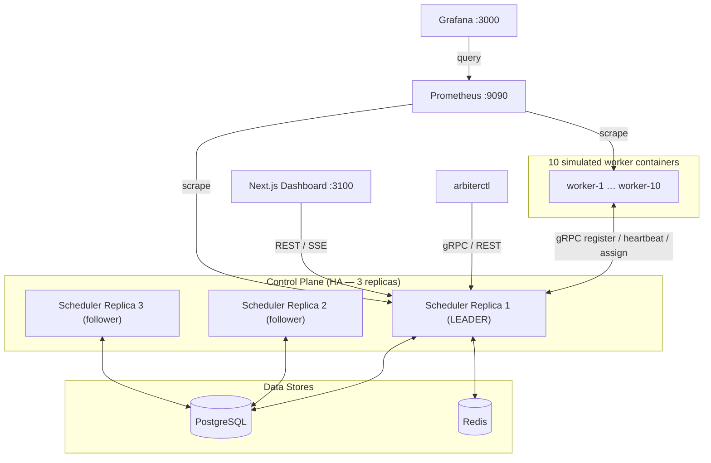

# Arbiter — Distributed Scheduler & Compute Orchestration

Arbiter is a from-scratch distributed scheduler / compute orchestrator — a small, student-scoped
cousin of Kubernetes, Borg, Nomad, and Mesos. A cluster of worker nodes runs tasks; a leader-elected
scheduler control plane decides where those tasks run, monitors node health via heartbeats, and
automatically reassigns work when a node fails.

**Resume claim this repo measures (see [`docs/benchmarks/phase10-resume-metrics.md`](docs/benchmarks/phase10-resume-metrics.md)):**

> Built a cluster scheduler sustaining 500+ concurrent tasks across 10 nodes via leader-elected
> coordination, heartbeat-based failure detection with sub-3s failover, bin-packing allocation, and
> automatic task reassignment

The full, phase-by-phase implementation plan lives in
[`IMPLEMENTATION_PLAN.md`](IMPLEMENTATION_PLAN.md). Architecture diagrams are in
[`docs/architecture.md`](docs/architecture.md).

**Status:** Phases 0–10 complete. Ready to run locally on **Windows PowerShell** (Docker Desktop) as
well as WSL2 / Linux / macOS. Guide: **[`docs/local-setup.md`](docs/local-setup.md)**.

## Architecture



## Tech Stack

Go · gRPC/Protobuf · PostgreSQL · Redis · Docker · Prometheus · Grafana · Next.js/TypeScript ·
Python (tooling) · PowerShell (Windows host helpers)

## Quick start (Windows PowerShell)

Requires [Docker Desktop](https://www.docker.com/products/docker-desktop/) (WSL2 backend),
[Go 1.22+](https://go.dev/dl/), [Python 3](https://www.python.org/downloads/), and Git.

```powershell
git clone https://github.com/AnishK05/arbiter-distributed-scheduler.git
cd arbiter-distributed-scheduler

# Once if needed: Set-ExecutionPolicy -Scope CurrentUser RemoteSigned
.\scripts\arbiter.ps1 demo-up
.\scripts\arbiter.ps1 build
.\scripts\arbiter.ps1 demo-verify

.\bin\arbiterctl.exe submit demo --replicas 5 --wait
.\scripts\arbiter.ps1 demo-down
```

| Surface | URL |
|---|---|
| **Dashboard** | http://localhost:3100 |
| **Grafana** | http://localhost:3000 (admin/admin, anonymous Viewer) |
| **Prometheus** | http://localhost:9090 |
| Scheduler API / gRPC | http://localhost:8080 · `localhost:7000` |

`.\scripts\arbiter.ps1` mirrors Makefile targets (`demo-up`, `build`, `up`/`down`, phase stacks,
`test`, …) so you never need `make` on Windows.

### WSL2 / Linux / macOS

```bash
make demo-up && make build && make demo-verify
./bin/arbiterctl submit demo --replicas 5 --wait
make demo-down
```

Full prerequisites, troubleshooting, failover demos, and the 500+ concurrency recipe:
**[`docs/local-setup.md`](docs/local-setup.md)**.

## Prerequisites

- Docker Desktop (Windows/macOS) or Docker Engine + Compose v2 (Linux)
- Go 1.22+ (repo pin: 1.22.2 / `GOTOOLCHAIN=local`)
- Python 3, git
- `make` (WSL/Linux/macOS only — optional on Windows when using `arbiter.ps1`)
- (Optional, only if you edit `.proto` files) `make tools` / install buf plugins

## Demo cluster details

Worker capacities are **varied** (1000m–4000m) and total **23500m** simulated CPU / ~12 GiB mem so a
packed burst can sustain 500+ concurrent running tasks. This is a simulated multi-node cluster on
one machine (see Section 12 Q3 in the plan).

```powershell
# PowerShell — Section 10 concurrency (16 MiB requests; 32 MiB memory-binds ~376 concurrent)
docker pull busybox:1.36
python scripts\load_test.py --tasks 750 --cpu-millicores 30 --memory-mb 16 `
  --image busybox:1.36 --command sleep --command 55 `
  --wait-complete --policy bin_pack
```

```bash
# bash / WSL
docker pull busybox:1.36
python3 scripts/load_test.py --tasks 750 --cpu-millicores 30 --memory-mb 16 \
  --image busybox:1.36 --command sleep --command 55 \
  --wait-complete --policy bin_pack
```

Measured resume metrics: [`docs/benchmarks/phase10-resume-metrics.md`](docs/benchmarks/phase10-resume-metrics.md).

## Incremental phase stacks

```powershell
.\scripts\arbiter.ps1 up
.\scripts\arbiter.ps1 phase6-up
.\scripts\arbiter.ps1 phase8-up
.\scripts\arbiter.ps1 phase9-up
```

```bash
make up              # 1 scheduler + 1 worker
make phase4-up       # + 5 equal workers (placement)
make phase6-up       # 3 scheduler replicas (HA)
make phase7-up       # + Prometheus/Grafana
make phase8-up       # + dashboard :3100
make phase9-up       # + simulated autoscaler
```

```powershell
.\bin\arbiterctl.exe submit demo --replicas 5 --wait
python scripts\load_test.py --replicas 100 --cpu-millicores 50 --policy bin_pack
python scripts\chaos_monkey.py --duration-s 40 --interval-s 5
python scripts\measure_leader_failover.py --trials 5 --submit-after
```

Run `.\scripts\arbiter.ps1 help` or `make help` for all targets.

## Repository Layout

See [`docs/architecture.md`](docs/architecture.md#repository-map).

## Testing

```powershell
.\scripts\arbiter.ps1 vet
.\scripts\arbiter.ps1 test
```

```bash
make vet && make lint && make test
```

CI (`.github/workflows/ci.yml`) runs build/vet/lint/test on every push/PR.

Integration tests need Compose Postgres/Redis — see [`docs/local-setup.md`](docs/local-setup.md).

## Benchmarks

Archived evidence for every phase DoD (and the Section 10 resume metrics) lives under
[`docs/benchmarks/`](docs/benchmarks/).

## Documentation

| Doc | Purpose |
|---|---|
| [`docs/local-setup.md`](docs/local-setup.md) | **Run everything locally** (PowerShell + WSL/Linux/macOS) |
| [`docs/architecture.md`](docs/architecture.md) | Architecture + repository map |
| [`docs/design-decisions.md`](docs/design-decisions.md) | Per-phase design choices |
| [`docs/benchmarks/`](docs/benchmarks/) | Measured DoD / resume evidence |
| [`IMPLEMENTATION_PLAN.md`](IMPLEMENTATION_PLAN.md) | Full build plan |
| [`scripts/README.md`](scripts/README.md) | Load test / chaos / failover / `arbiter.ps1` |
