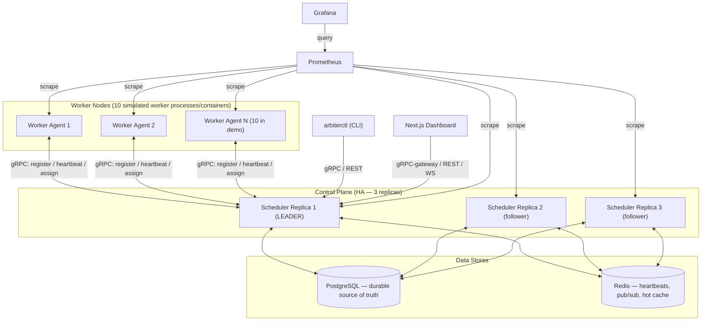
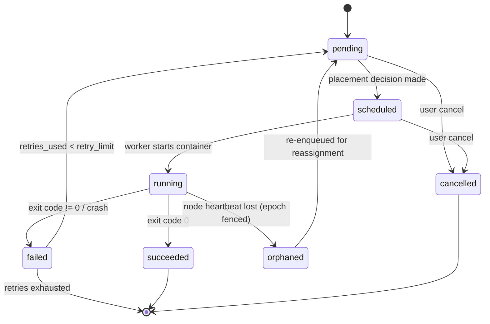
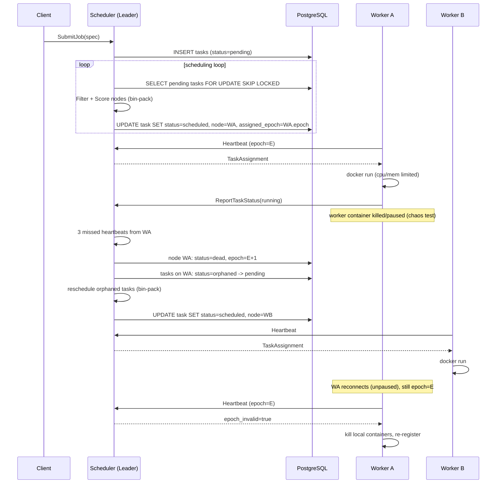

# Arbiter Architecture

This is a quick-reference architecture doc. For the full rationale behind every decision here, see
[`IMPLEMENTATION_PLAN.md`](../IMPLEMENTATION_PLAN.md) at the repo root — that document is the
source of truth; this page just collects the diagrams and a short summary for fast orientation.

## System Overview

Arbiter is a distributed scheduler: a control plane (3 leader-elected scheduler replicas) places
tasks onto worker nodes (10 simulated worker processes/containers in the demo cluster), monitors
their health via heartbeats, and automatically reassigns work when a node fails.

Only the elected leader makes placement decisions and talks to workers; followers stay hot and
ready to take over via a Postgres-lease-based leader election (Section 6.6 of the implementation
plan).

## Task Lifecycle

## Happy Path + Failover Sequence

## Repository Map

| Path | Purpose |
|---|---|
| `cmd/scheduler` | Control-plane binary (gRPC + HTTP servers; placement, failure detection, election in later phases) |
| `cmd/worker` | Worker-agent binary (registration, heartbeats, task execution in later phases) |
| `cmd/arbiterctl` | CLI client |
| `internal/grpcapi` | gRPC service implementations for `ClusterControl` / `SchedulerAPI` |
| `internal/scheduler` | Placement engine (filter/score, queue, retry) — Phase 3+ |
| `internal/election` | Leader election (Postgres lease + fencing epochs) |
| `internal/failuredetector` | Heartbeat-timeout tracking — Phase 2 |
| `internal/store` | Postgres repositories — Phase 1+ |
| `internal/cache` | Redis client wrappers — Phase 2+ |
| `internal/executor` | Docker-based task execution on the worker — Phase 3 |
| `internal/metrics` | Prometheus collectors — Phase 7 |
| `gen/` | Generated protobuf/gRPC Go code (from `proto/`, via `make proto`) |
| `proto/` | `.proto` service/message definitions + buf config |
| `migrations/` | SQL schema migrations |
| `dashboard/` | Next.js + TypeScript web UI — Phase 8 |
| `scripts/` | Python tooling: load-test, chaos monkey, failover measurement |
| `deploy/` | Docker Compose stacks, Prometheus/Grafana config |
| `docs/` | This doc, design-decision notes, and archived benchmark output |

See [`IMPLEMENTATION_PLAN.md`](../IMPLEMENTATION_PLAN.md) for the full phase-by-phase build plan,
data model, gRPC API, and the decisions log.
